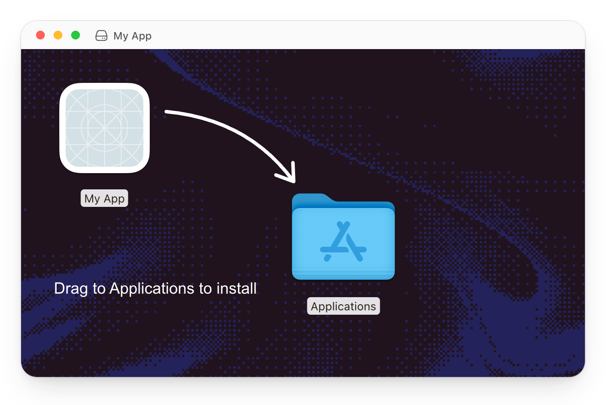

<p align="center">
  
</p>

<h1 align="center">Dmgly</h1>

<p align="center">
  <strong>Make the first drag count.</strong><br />
  Design your macOS installer in the browser. Export the artwork and packaging config.
</p>

<p align="center">
  <a href="#export"></a>
  <a href="#export"></a>
  <a href="#export"></a>
</p>

<p align="center">
  <a href="#design">Design</a> · <a href="#export">Export</a> · <a href="#run-locally">Run locally</a>
</p>

---

## Design

- **Arrange it.** Drag the app, Applications folder, text, and arrow in a live Finder-style preview.
- **Make it yours.** Set exact positions, window size, typography, colors, gradients, and image backgrounds.
- **Fine-tune it.** Arrow keys move 1 px; Shift+Arrow moves 10 px. Undo/redo spans canvas and controls.
- **Keep the link.** Composition settings live in the URL through nuqs. Bookmark or share it to reopen the layout. Uploaded images stay on this device in IndexedDB and must be uploaded again on another device.
- **Start fresh.** Reset returns to the default design and clears its URL settings. Undo can restore the previous composition. Opening the site without design parameters always starts with the default.

## Export

Choose a target, then copy the config or download a ZIP.

| Your app | Exported file |
| --- | --- |
| Electron | `electron-builder.dmg.json` — config fragment |
| Tauri 2 | `tauri.dmg.json` — config fragment |
| Native macOS / Swift | `build-dmg.sh` — packages an existing `.app` with create-dmg |

Each ZIP includes a **1× PNG background**, the selected config or script, setup instructions, and an AI setup prompt. Uploaded app icons are included as PNG references. Prompts are generated locally; no AI API is called.

> Design here, build on macOS. Apply the export in your app repository to create the actual DMG. App and Applications icons remain native Finder items.

## Run locally

```sh
bun install
bun run dev
```

Open [localhost:3000](http://localhost:3000).

### Analytics

Production builds track page views and outgoing links with OpenPanel at `https://op.kapish.dev/api`. Development runs do not send analytics. The integration uses a public client ID; no client secret is needed or shipped to the browser.

Allow the deployed site's domain in the OpenPanel project settings. A `401` response with `Invalid cors or secret` means browser ingestion is not authorized for that origin.

Page views follow pathname changes only, so editing design settings in the URL does not create extra views or send the composition query. Session replay is disabled. The integration lives in [`components/analytics.tsx`](components/analytics.tsx).

<details>
<summary>Development commands &amp; internals</summary>

```sh
bun run test
bun run typecheck
bun run lint
bun run build
bun run start
```

Built with Next.js, React, nuqs, DialKit, Zod, and fflate. Editor UI lives in [`components/editor`](components/editor); document state, image persistence, artwork, and export adapters live in [`lib/dmgly`](lib/dmgly).

[Product design](docs/plans/2026-09-14-dmg-preview-design.md) · [Packaging contract](docs/research/packaging-contract.md) · [Verification](docs/verification/mvp.md)

</details>

## Before you ship

- Finder chrome, labels, and icons are approximate in the preview; native icon size is 128 px.
- Uploads: PNG, JPEG, or WebP; up to 10 MB, 8192 px per side, and 16 megapixels. No ICNS/SVG uploads or Retina backgrounds yet.
- For Tauri/create-dmg builds, pause any tiling window manager rules that resize Finder.
